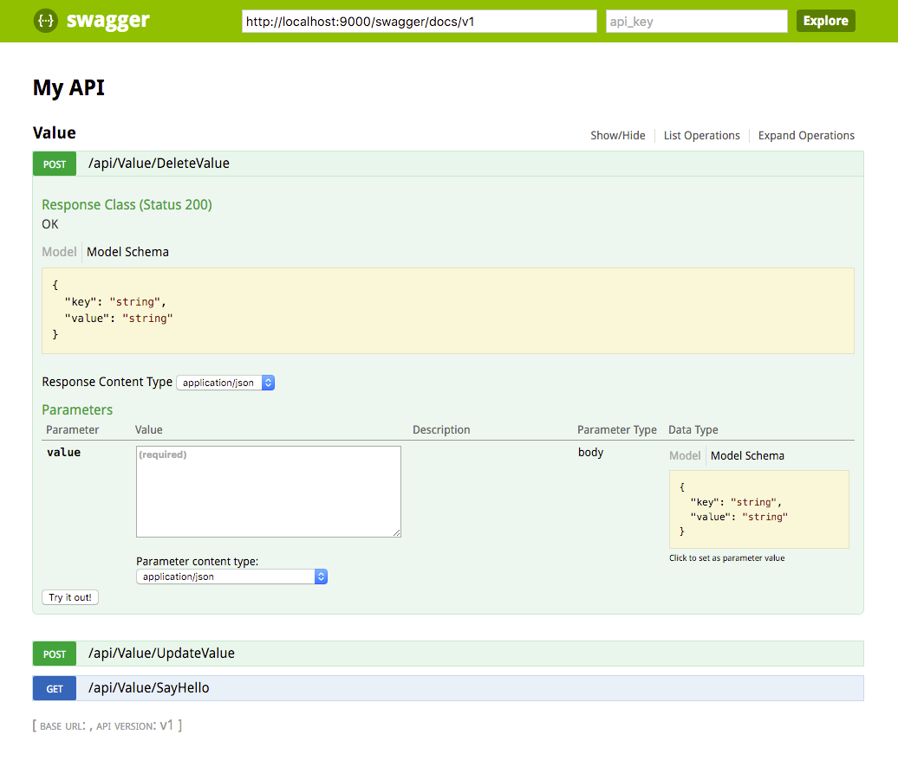

- https://sergeytihon.wordpress.com/2015/09/06/swagger-for-f-web-apps

## Create project

```bash
yo fsharp
```

## Issue - Not registered task

```bash
╰─$ xbuild
XBuild Engine Version 14.0
Mono, Version 4.4.0.0
Copyright (C) 2005-2013 Various Mono authors

Build started 4/18/2016 11:42:44 PM.
__________________________________________________
Project "/Users/wk/Source/fsharp/fsharp-swagger/fsharp-swagger/fsharp-swagger.fsproj" (default target(s)):
        Target BeforeBuild:
: error : Error initializing task MSBuild.ExtensionPack.FileSystem.File: Not registered task MSBuild.ExtensionPack.FileSystem.File.
                Build FAILED.
                Errors:
                /Users/wk/Source/fsharp/fsharp-swagger/fsharp-swagger/fsharp-swagger.fsproj (default targets) ->
                (BeforeBuild target) ->
                        : error : Error initializing task MSBuild.ExtensionPack.FileSystem.File: Not registered task MSBuild.ExtensionPack.FileSystem.File.
                         0 Warning(s)
                         1 Error(s)
                Time Elapsed 00:00:00.1794100
```

#### Fixed

- File update `fsharp-swagger.fsproj` convert `..` to `$(MSBuildProjectDirectory)`

```xml
<UsingTask
    AssemblyFile="..\packages\MSBuild.Extension.Pack\tools\net40\MSBuild.ExtensionPack.dll"
    TaskName="MSBuild.ExtensionPack.FileSystem.File"
    Condition="Exists('..\packages\MSBuild.Extension.Pack\tools\net40\MSBuild.ExtensionPack.dll')" />
```

```xml
<UsingTask
    AssemblyFile="$(MSBuildProjectDirectory)\packages\MSBuild.Extension.Pack\tools\net40\MSBuild.ExtensionPack.dll"
    TaskName="MSBuild.ExtensionPack.FileSystem.File"
    Condition="Exists('$(MSBuildProjectDirectory)\packages\MSBuild.Extension.Pack\tools\net40\MSBuild.ExtensionPack.dll')" />
```

## Add dependencies

```
paket add nuget Microsoft.AspNet.WebApi.OwinSelfHost project fsharp-swagger.fsproj
paket add nuget Swashbuckle.Core project fsharp-swagger.fsproj
```

## Use self host

- File Startup.sh

```fsharp
[<EntryPoint>]
let main argv =
        let baseAddress = "http://localhost:9000"

        printf "|| start | %s\n" baseAddress

        use app = WebApp.Start<Startup>(url = baseAddress)
        Console.ReadLine() |> ignore
        0
```

- File Controllers\Api.fs

```fsharp
type Value =
    { Key: string
      Value: string }

type ValueController() =
    inherit ApiController()

    [<HttpPost>]
    member this.DeleteValue(value: Value) =
        value

    [<HttpPost>]
    member this.UpdateValue(value: Value) =
        value

    [<HttpGet>]
    member this.SayHello() =
        "Hello, world!"
```

## Compile and test

```bash
./run.sh
http://localhost:9000/api/value/get
```

## Enable Swagger UI

- File Startup.fs

``` fsharp
static member RegisterWebApi(config: HttpConfiguration) =
    // Configure routing
    config.MapHttpAttributeRoutes()
    config.EnableSwagger(fun c -> c.SingleApiVersion("v1", "My API") |> ignore).EnableSwaggerUi()
```

## Issue - TargetInvocationException

```
Time Elapsed 00:00:00.3799170
|| start | http://localhost:9000

Unhandled Exception:
System.Reflection.TargetInvocationException: Exception has been thrown by the target of an invocation. ---> System.TypeLoadException: Failure has occurred while loading a type.
  at FSharpSwagger.Startup.RegisterWebApi (System.Web.Http.HttpConfiguration config) <0x2e472b0 + 0x00023> in <filename unknown>:0
  at FSharpSwagger.Startup.Configuration (IAppBuilder builder) <0x7f1a78 + 0x00037> in <filename unknown>:0
  at (wrapper managed-to-native) System.Reflection.MonoMethod:InternalInvoke (System.Reflection.MonoMethod,object,object[],System.Exception&)
  at System.Reflection.MonoMethod.Invoke (System.Object obj, BindingFlags invokeAttr, System.Reflection.Binder binder, System.Object[] parameters, System.Globalization.CultureInfo culture) <0x1a7c600 + 0x000a1> in <filename unknown>:0
```

#### Fixed

- https://github.com/domaindrivendev/Swashbuckle/issues/555


## Issue - FileNotFoundException

```
|| start | http://localhost:9000

Unhandled Exception:
System.Reflection.TargetInvocationException: Exception has been thrown by the target of an invocation. ---> System.IO.FileNotFoundException: Could not load file or assembly 'System.Net.Http, Version=4.0.0.0, Culture=neutral, PublicKeyToken=b03f5f7f11d50a3a' or one of its dependencies.
File name: 'System.Net.Http, Version=4.0.0.0, Culture=neutral, PublicKeyToken=b03f5f7f11d50a3a'
  at (wrapper managed-to-native) System.Reflection.MonoMethod:InternalInvoke (System.Reflection.MonoMethod,object,object[],System.Exception&)
  at System.Reflection.MonoMethod.Invoke (System.Object obj, BindingFlags invokeAttr, System.Reflection.Binder binder, System.Object[] parameters, System.Globalization.CultureInfo culture) <0x1a7c600 + 0x000a1> in <filename unknown>:0
```

#### Fixed

- File fsharp-swagger.exe.config

```xml
<dependentAssembly>
  <assemblyIdentity name="System.Net.Http" publicKeyToken="b03f5f7f11d50a3a" culture="neutral" />
  <bindingRedirect oldVersion="0.0.0.0-2.0.0.0" newVersion="4.0.0.0" />
</dependentAssembly>
```